# Implement this Solution

## Analyze Results Logic App - send single-page PDF document data to REST API endpoint of trained custom document model

Next step is to open the Logic App designer in the Azure portal for the second Logic App you deployed with "analyzeresults" in the name.

 

1. Add the **Azure Blob Storage** trigger When a blob is added or modified (properties only) (V2) with the following settings:

|Property|Setting|
|---|---|
|Storage account name	|Use connection settings|
|Container	|/single|
|Number of blobs to return	|1|
|How often to you want to check for items	|1 Minute|

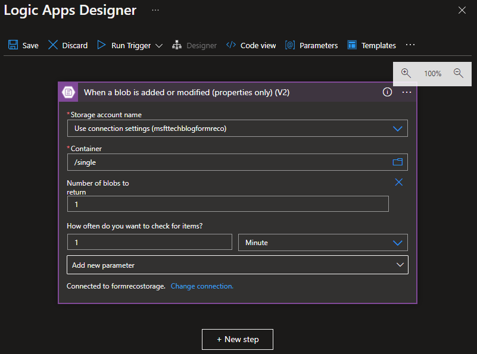

2. Add a new step: **Create SAS URI by path (V2)** with the following settings:

|Property|Setting|
|---|---|
|Storage account name	|Use connection settings|
|Blob path	|List of Files Path (Dynamic Expression)|

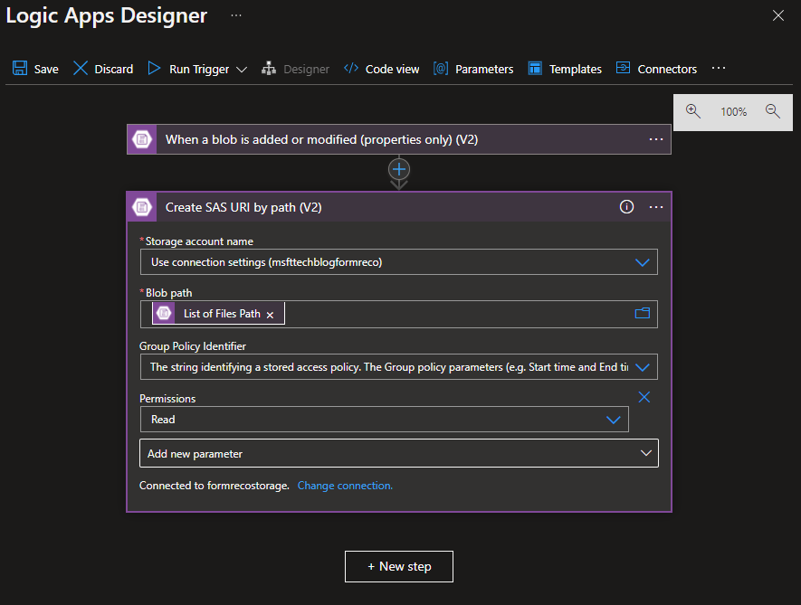

3. Add a new step: **HTTP**
Please note that you will have to replace a few variables tailored to your resource deployment. Here are the variables you must replace:

- **FORM_RECO_URI**: this is the Endpoint of your Form Recognizer service in Azure. You can find your endpoint here after navigating to your Form Recognizer service that was created during resource deployment.

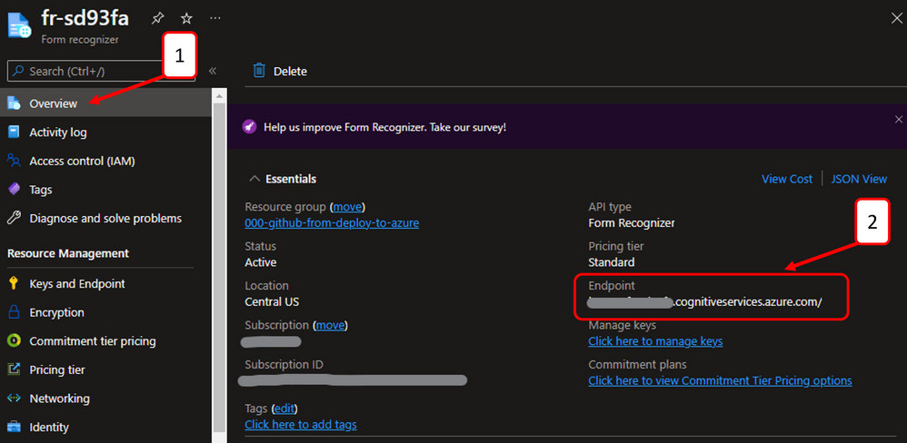

- **FORM_RECO_KEY**: this is the Key used to access your Cognitive Service API. You can find your Key here after navigating to your Form Recognizer service that was created during resource deployment.

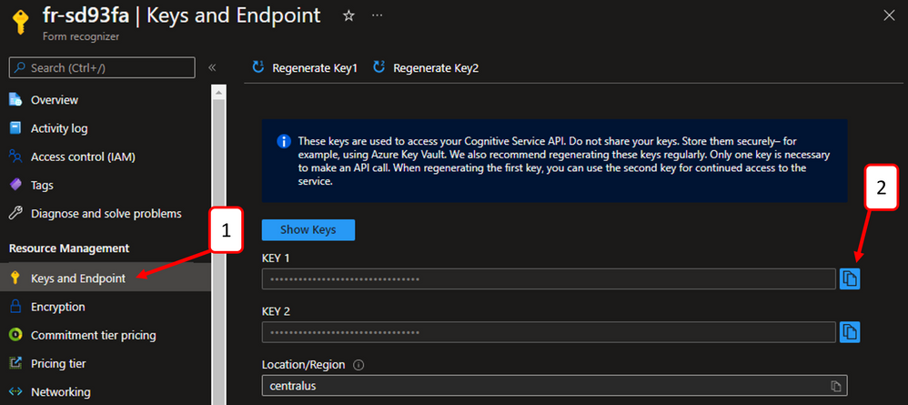

- **MODEL_ID**: this is the Model ID that you created while training a custom document model in Form Recognizer Studio.

|Property|Setting|
|---|---|
|Method	|POST|
|URI |\<FORM_RECO_URI>/formrecognizer/documentModels/<MODEL_ID>:analyze?api-version= 2022-01-30-preview|
|Headers | Ocp-Apim-Subscription-Key \<FORM_RECO_KEY>
|Body	  | {"urlSource": "@{body('Create_SAS_URI_by_path_(V2)')?['WebUrl']}"}|

4. Add a new step: **Initialize variable** with the following settings:

|Property|Setting|
|---|---|
|Name	|analyze-status|
|Type	|String|
|Value	| @{null}|

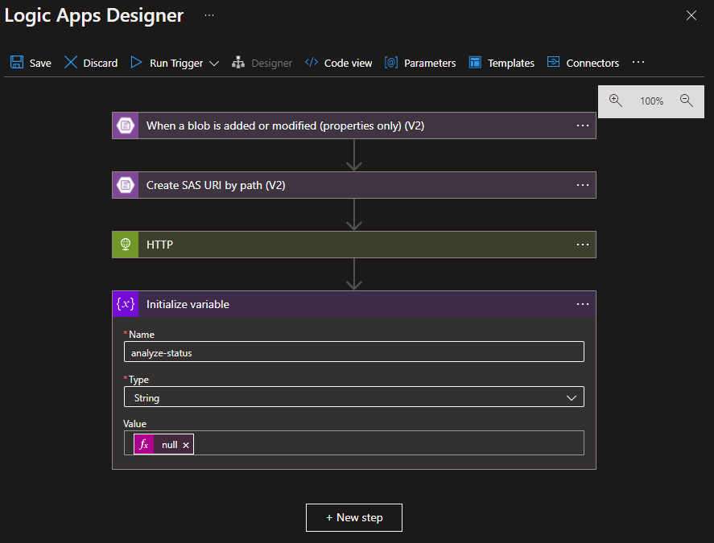

5. Add a new step: **Until** with the following settings

|Property|
|---|
|analyze-status|
|is equal to|
|succeeded|

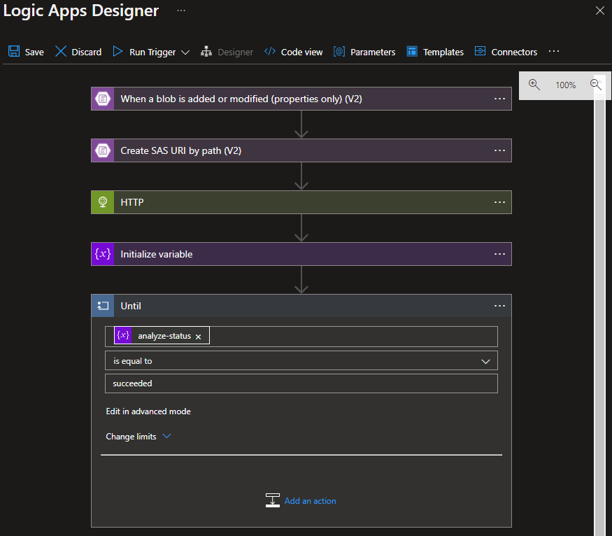

6. Add an action: **HTTP** with the following settings

|Property|Setting|
|---|---|
|Method	 	|GET|
|URI	 	| @{outputs('HTTP')['headers']['Operation-Location']}|
|Headers	|Ocp-Apim-Subscription-Key	\<FORM_RECO_KEY>|

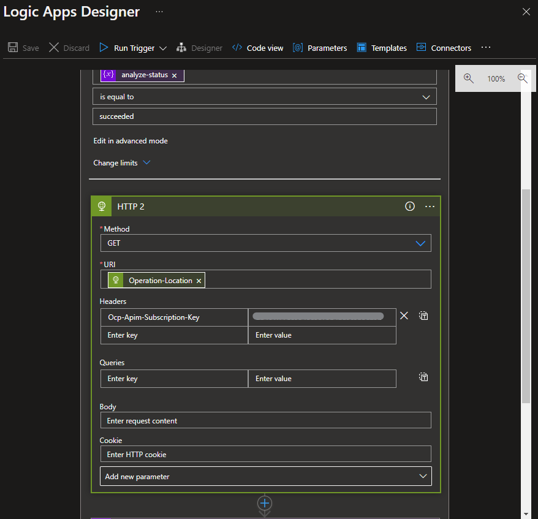

7. Add an action: **Set variable**

|Property|Setting|
|---|---|
|Name	| analyze-status|
|Value	| @{body('HTTP_2')['status']}|

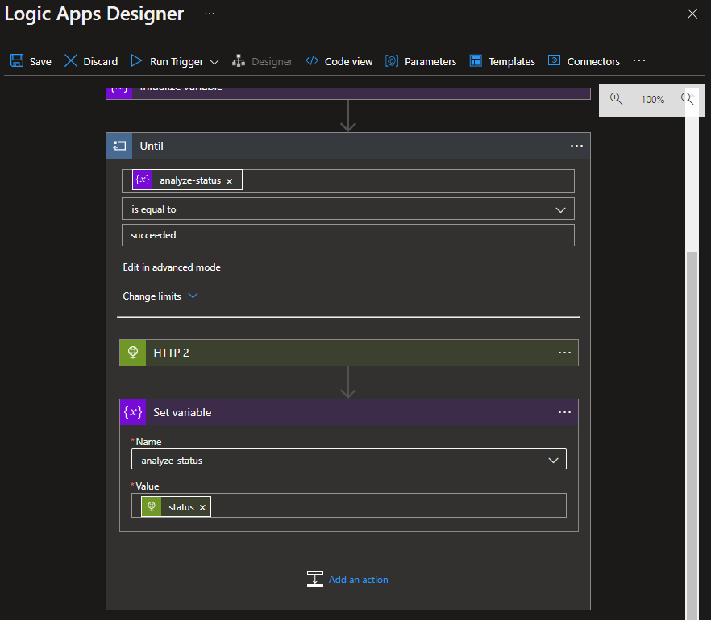

8. Add an action: **Delay**

|Property|Setting|
|---|---|
|Count	|10|
|Unit	|Second|

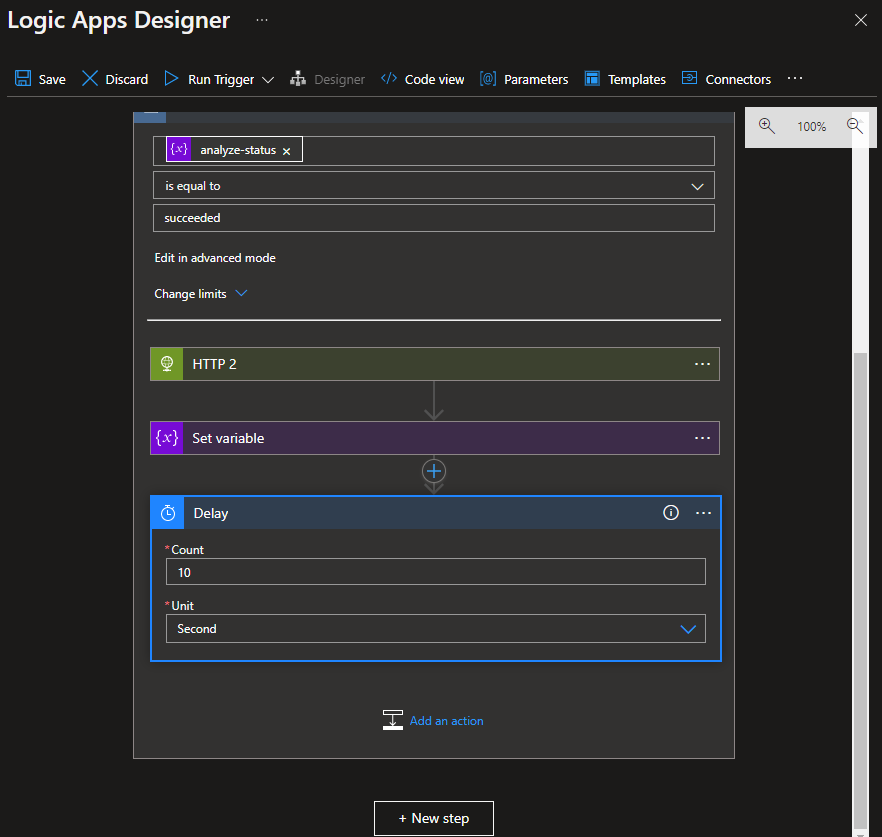

9. Add a new step: **Create blob (V2)**

|Property|Setting|
|---|---|
|Storage account name	|Use connection settings|
|Folder path	|/results|
|Blob name	| @{replace(triggerBody()?['DisplayName'], '.pdf', '.json')}|
|Blob content	| @body('HTTP_2')|

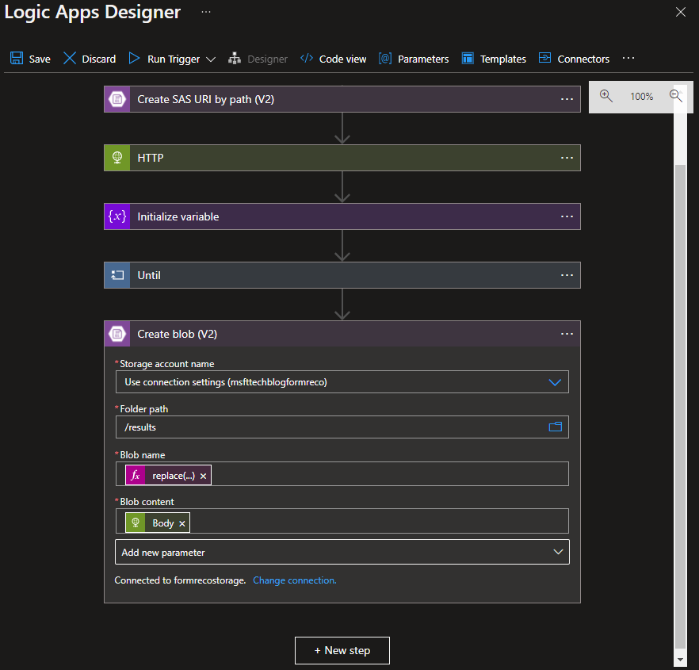

10. Click Save. Your Logic App should now look like this:

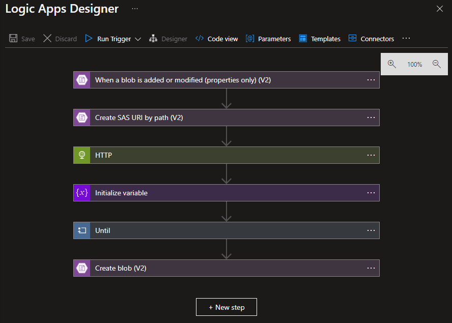

## Next Steps

[Verify the functionality](07-verify-the-functionality.md)